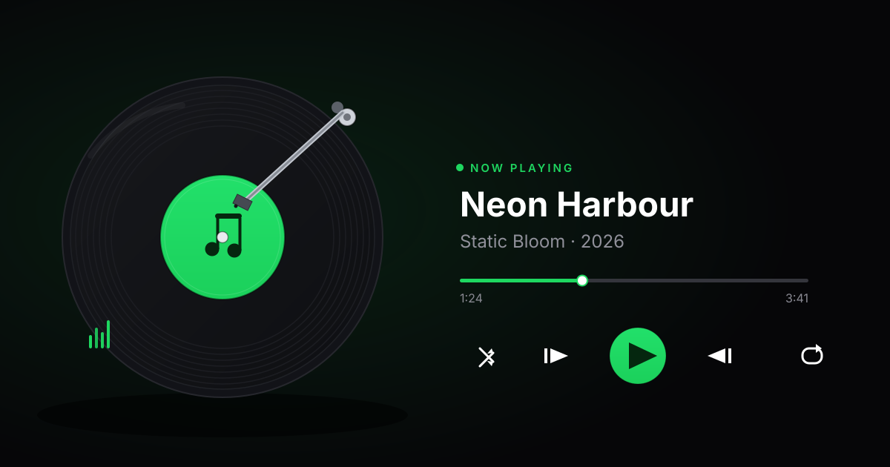

# 🎧 spotify-minimal

> A single-page Spotify player that runs in any browser tab. Dark UI, vinyl-turntable album art, and **multi-user**: anyone can log in with their own Spotify account and get a private, isolated session.

<div align="center">
  <a href="https://music.sidcandev.online">
    
  </a>
</div>

<div align="center">

**[▶ Try the live player](https://music.sidcandev.online)** · **[Deploy your own](#-self-host-for-developers)** · **[FAQ](#-faq--troubleshooting)**


</div>

---

## ✨ Features

- 🎛️ **Real turntable** — the album art is a vinyl record that spins while playing and freezes where it stopped on pause, with a tonearm that swings onto the groove
- ▶️ **Full transport controls** — play/pause, previous/next, seek bar, shuffle, repeat (off · all · one), volume
- 📚 **Playlist browser** — your playlists with covers, a per-playlist track list, and play-from-anywhere
- ❤️ **Liked Songs** — browse your saved songs and play any of them (up to 200)
- ☀️ **daylist** — one tap to today's daylist, resolved live so it never 404s when Spotify rotates the id
- ⏭️ **Upcoming queue** — peek at the next tracks on hover; click one to jump to it
- 🔍 **Focus mode** — click the album art to center the player; one click back to the two-column layout
- 👥 **Multi-user** — each visitor gets their own isolated Spotify session (anonymous id + server-issued secret); logging out never touches anyone else
- 🔒 **Secure by default** — PKCE OAuth, JWT-verified functions, refresh token never leaves the server
- 💸 **$0/month** — static site on Cloudflare Pages, backend on Supabase's free tier, no build step

---

## 🚀 Using the player (for visitors)

1. Open **[music.sidcandev.online](https://music.sidcandev.online)** on any device.
2. Tap **Connect Spotify** → approve the permission screen → you land back on the player.
3. Tap **▶** or open a playlist — the tab streams the audio.

**Good to know**

- A **Spotify Premium** account is required — the Web Playback SDK refuses free accounts (that's Spotify's rule).
- The **browser tab is the player** — music stops when the tab closes (by design; no server churns 24/7).
- **One active device per account** — playing in the Spotify app elsewhere will steal playback (or vice versa).
- If the **daylist** says "no daylist found", open today's daylist in the Spotify app once — it's auto-saved to your library, then the site picks it up.
- **Reconnect Spotify** after logging out, or any time a feature asks for a new permission — one click, your session and playlists come right back.

---

## 🧱 Architecture

Everything runs on free tiers; the browser tab does the streaming.

```mermaid
flowchart LR
    A[Visitor's browser<br/>site/ index.html + Web Playback SDK] -->|fetch · Bearer anon key<br/>x-app-user / x-app-secret| B[Supabase Edge Functions<br/>auth · player · control]
    B -->|tokens + Spotify Web API| C[(Supabase Postgres<br/>user_tokens · app_state)]
    B --> D[Spotify Web API<br/>playlists · tracks · now-playing]
    A -->|audio streaming| D
    style A fill:#121212,stroke:#1ed760
    style B fill:#121212,stroke:#3ECF8E
    style C fill:#121212,stroke:#3ECF8E
    style D fill:#121212,stroke:#1DB954
```



1. **Connect** — `/auth/start` redirects to Spotify with PKCE; `/auth/callback` exchanges the code and stores the refresh token in the database, tied to your browser's identity.
2. **Listen** — the browser SDK asks `/player/token` for short-lived access tokens (minted server-side from your refresh token).
3. **Control** — play/pause/seek/volume hit `/control/*`, which drive the same active SDK device via Spotify's API.

---

## 🛠 Self-host (for developers)

<details>
<summary><b>Full setup — click to expand</b></summary>

### Prerequisites

- A **Spotify Premium** account (the Web Playback SDK refuses free accounts)
- A Spotify app in the [Developer Dashboard](https://developer.spotify.com/dashboard)
- [Supabase CLI](https://supabase.com/docs/guides/cli) and a free Supabase project
- Any static host for the frontend (Cloudflare Pages, Netlify, GitHub Pages…)

### 1. Create the Spotify app

1. Go to the Developer Dashboard → **Create app**.
2. Copy the **Client ID** and **Client Secret**.
3. Add a **Redirect URI** — exactly this (fill in your project ref):

   ```
   https://<project-ref>.supabase.co/functions/v1/auth/callback
   ```

### 2. Link and migrate the Supabase project

```bash
supabase login
supabase init
supabase link --project-ref <project-ref>
supabase db push          # applies supabase/migrations/*.sql
```

### 3. Set the secrets

```bash
supabase secrets set \
  SPOTIFY_CLIENT_ID=<client-id> \
  SPOTIFY_CLIENT_SECRET=<client-secret> \
  SPOTIFY_REDIRECT_URI=https://<project-ref>.supabase.co/functions/v1/auth/callback \
  SITE_URL=https://<your-domain> \
  ALLOWED_ORIGIN=https://<your-domain> \
  PLAYLIST_ID=spotify:playlist:<playlist-id>
```

> **CLI 2.113+ note:** the old `[functions]` section in `config.toml` was
> removed — do **not** add one, the parser rejects it. JWT settings are now a
> deploy flag (below), not config.

### 4. Deploy the functions

```bash
supabase functions deploy auth --no-verify-jwt
supabase functions deploy player control
```

`auth` runs without JWT verification because a browser redirect can't attach
an `Authorization` header; `player` and `control` keep the default
verification, so Supabase's gateway rejects any call without the anon key.

Verify the backend with:

```
https://<project-ref>.supabase.co/functions/v1/auth/start
```

It should redirect you to Spotify's login page.

### 5. Point the frontend at your project

In `site/index.html`, set two values:

| Constant | Value |
|---|---|
| `API_BASE` | `https://<project-ref>.supabase.co/functions/v1` |
| `ANON_KEY` | your project's publishable (anon) key — public by design |

Then deploy `site/` as a static site: **build command** none, **output
directory** `site`. On Cloudflare Pages: connect the repo → add your custom
domain → add the `CNAME` at your DNS provider pointing at the Pages project.

> `?api=<url>` overrides `API_BASE` in the browser — handy for testing against
> a local functions server before you deploy.

### 6. Connect and play

Open your site → **Connect Spotify** → approve the permission screen → you land
back on the player. Press **▶** or open a playlist.

To change the default playlist, update the `PLAYLIST_ID` secret or the
`playlist_id` row in the `app_state` table.

</details>

---

## 🔐 Security model

| Key | Where it lives | Why it's safe |
|---|---|---|
| Publishable (anon) | Embedded in `site/index.html`, sent as `Authorization: Bearer` | Public by design; the gateway JWT-verifies `player`/`control` calls with it |
| Service role (secret) | Auto-injected into Edge Functions only | Used to store refresh tokens; never reaches the browser or the repo |
| Spotify client secret | Supabase secrets | Never in the repo or frontend |
| Session secret | Issued by `/auth/start`, returned in a URL **fragment** | Proves your anonymous id is really yours — a public id alone can't read or control anyone else's session |

- The Spotify **refresh token is stored in the database**; the browser only ever
  sees short-lived access tokens minted server-side.
- Each visitor's tokens, device, and default playlist live in their own
  `user_tokens` row — **no one can act as another user** without that user's
  session secret.
- `player`/`control` are **JWT-verified** at the gateway, so unauthenticated
  calls are rejected before any code runs.
- **CORS is locked down** via the `ALLOWED_ORIGIN` secret — browsers on other
  origins can't call your functions.
- **No secrets in the repo** — everything sensitive lives in Supabase secrets
  and `.env` (gitignored).

---

## ❓ FAQ & troubleshooting

<details>
<summary><b>“No daylist found — open the daylist in the Spotify app once, then retry”</b></summary>

Spotify regenerates the daylist several times a day under a brand-new playlist
id, so a pinned id 404s within hours. This player resolves the *live* daylist
from your own playlist list instead — but if you've never opened a daylist,
none exists yet. Open today's daylist in the Spotify app once (it auto-saves
to your library), then retry.
</details>

<details>
<summary><b>Liked Songs won't load</b></summary>

Browsing your saved songs needs the `user-library-read` permission. Sessions
connected before that scope existed don't have it. Tap **Reconnect Spotify** in
the liked-songs view (or log out and connect again) — one tap grants it.
Playback keeps working either way.
</details>

<details>
<summary><b>“No active device — keep this tab open, then retry”</b></summary>

Spotify only streams to one device per account. Close other tabs/apps playing
with the same account, or press ▶ once to wake the SDK in this tab, then retry.
</details>

<details>
<summary><b>No sound / “Invalid token scopes”</b></summary>

The audio needs the `streaming` scope, which requires **Spotify Premium** and a
reconnect if your session predates it. Reconnect Spotify once and check the
account is Premium.
</details>

<details>
<summary><b>I see the connect screen after the multi-user update</b></summary>

Your browser has an identity id but the session secret from before the update.
One **Reconnect Spotify** click moves your session into your own row — nothing
is lost.
</details>

<details>
<summary><b>The site is slow on first load</b></summary>

Free Supabase projects **auto-pause after 7 days idle**; the first request
after a pause is slow while the project wakes. Daily use avoids it.
</details>

---

## 📦 Repository layout

```
site/
  index.html            Static frontend — no build step. Deploy as-is.
docs/
  demo.svg              Hero image used by this README
supabase/
  functions/
    auth/               OAuth start / callback / logout (PKCE)
    player/             token, now-playing, device, playlists, playlist tracks
    control/            play, pause, next, previous
    _shared/            CORS helpers + Spotify API client (per-user sessions)
  migrations/           app_state, pkce_store, user_tokens
```

---

## 🧪 Local development

```bash
supabase start          # local Postgres + functions runtime
supabase functions serve
```

Set `SPOTIFY_REDIRECT_URI` to the local callback and
`SITE_URL`/`ALLOWED_ORIGIN` to your local frontend origin, then open
`site/index.html?api=http://127.0.0.1:54321/functions/v1`.

---

## 📄 License

[MIT](LICENSE)
